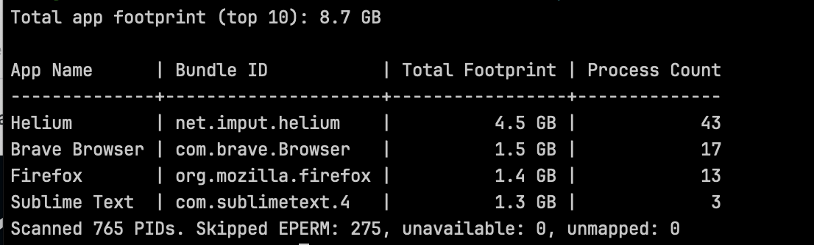

# mem

Tiny macOS Swift CLI that prints an application memory overview similar to the macOS "application memory" warning dialog, grouped by app.

It scans running PIDs with `libproc`, reads `ri_phys_footprint` via `proc_pid_rusage`, groups by app bundle identifier where possible, and sums memory across each app's processes.

## Installation

```bash
brew tap bohdanlevchenko/tap
brew install mem
```

## Build

```bash
swift build -c release
```

## Run

```bash
.build/release/mem --top 20
```

## Flags

- `--top N` (default `30`)
- `--json` machine-readable JSON output
- `--bytes` raw bytes instead of human-readable units
- `--include-others` include processes not mapped to `NSRunningApplication`
- `--min MB` minimum footprint threshold in MB
- `--verbose` print scan diagnostics to stderr

## Examples

```bash
.build/release/mem --top 30
.build/release/mem --top 20 --min 200
.build/release/mem --json --top 50
.build/release/mem --include-others --verbose
```

## Screenshot


